# JK Panorama Creation

This is a Computer vision based project to create panorama from group of images using corner 
and edge detection technique.
 
This project uses Harris corner detection for detecting image corners which will then be used to detect
Common features between images and stitch them together when specified confidence level is matched.

<b><i>
To run this project you have to have libpng library installed on your machine in addition to gcc compiler to run the code.
Libpng can be downloaded from http://ethan.tira-thompson.com/Mac_OS_X_Ports.html. There are other sources too, but I 
found this one incredibly easy and convenient to install. In addition to it, it only supports processing of files with png
Extension. If you have an image with extension other than this, please make sure you convert file with suitable converter
before feeding it to program.
</i></b>
<b>
To run the program we have already provided a makefile to compile and generate object file. Proper steps of compiling and running
program are as follows : 
</b>

 
Compile : make  
Run :  
<i> There are two modes this project can run :  </i>

For single file : 
 
./[object_file_name] 0 [output_file_name].png [input_file_name].png [sigma_for gauss_processing]
[kernel_size_for_image_processing] [threshold_to_detect_image_corner]
  

For Two files
 
./[object_file_name] 1 [output_file_name].png [input_file_name_one].png [input_file_name_two].png [sigma_for_gauss_processing]
[kernel_size_for_image_processing] [threshold_to_detect_image_corner]

<b>
Parameters are explained as follows : 
</b>
  
1. object_file_name - Name of generated object file after compiling program
  
2. input_file_name_* - Name of the input files to program. Usually, when second parameter decided if we want to create stitch
or just image process on single image. Second parameter with 1 and 0 indicates stitch (Two image inputs) and single image (Single
image as output) processing respectively. 
  
3. sigma_for_gauss_processing - Decides sigma parameter for applying Gaussian filter for an image. More sigma means more blur
effect added to an image
  
4. kernel_size_for_image_processing - This is basically mask of fixed values places over each pixel resulting in modifications
over same and other neighboring pixels around it. Larger is the kernel size, more it will blend image as per input mask
but it will increase processing time due to increased number of pixels to process
  
5. Threshold_to_detect_image_corner - When a corner detector algorithm runs over image, it has to have some threshold parameter
to gain enough confidence to detect respective corners. This parameters decides it given point / edge belongs to 
image corner or not. Height the value of this parameters, lesser corners will be detected as we have just raised the bar there.
  

Following documentation comes right from the project doc we submitted as ap part of course assignment : 
  
<b>Harris Corner Detector</b>

1. The first step in Harris Corner Detection is filtering the input images using a Gaussian filter. We
are re-using the Gaussian_filter function and convolve_separable function from a1.cpp. We use
a sigma of 3.0. The kernel size of the filter is 3X3.
  
2. The next step is finding the x-gradient and y-gradient of the images. We use the
sobel_gradient_filter from a1.cpp. The filter that we are using in this function is [1 1 1] and [-1 0
1]. These filters are used alternatively as column and row filters to generate the x-gradient and
y-gradient of the 2 input images.
  
3. R is calculated by the following formula: 
  
R=((gaussxsquare[i][j]*gaussysquare[i][j]) -
(pow(gaussxy[i][j],2)))- ( (0.01)* pow((gaussxsquare[i][j]+gaussysquare[i][j]),2) ).
  
The k value is taken as 0.01. Gaussian filter has a sigma of 1.0 and kernel size of 3X3
  
4. The threshold value of R is taken to be 3000. After trying for various images, we decided 3000 to
be optimum. If a point in the image has an R value greater than 3000, then we take it as a corner
and store it in a vector of struct Coordinate.
  
5. points’ is the vector of struct Coordinate and has the list of corners in it. Points is returned at
the end of the function find_corners_Harris.
  

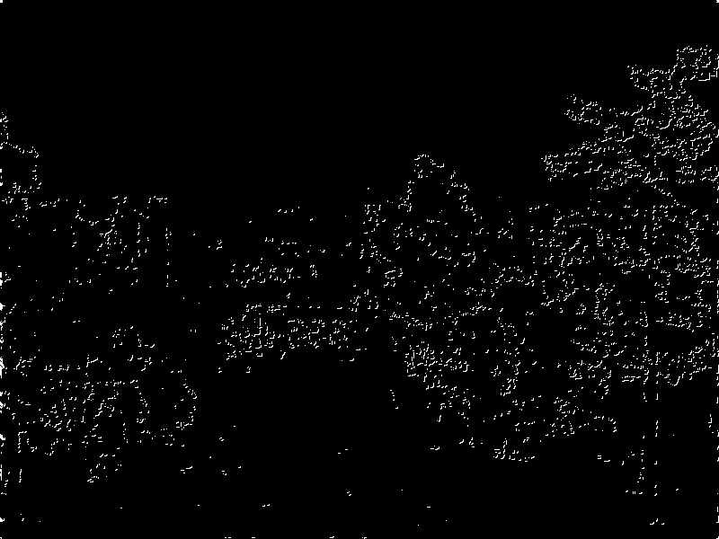

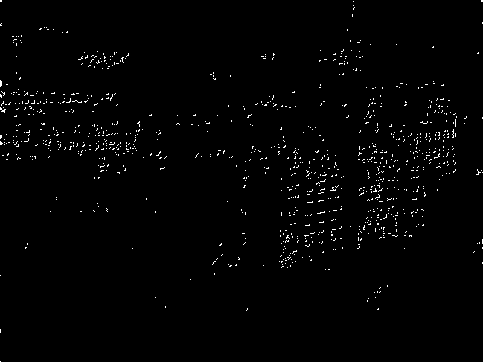

<b> Descriptors Estimation </b>
  
The size of the vector of corners is equal to the size of vector of descriptors. The following steps are used to
calculate the descriptors:
  
1. We are estimating the descriptors for every corner identified in the image in the function
invariant_descriptors. This function takes in the image and its vector of corners. We are
calculating 128-dimensional descriptors for every corner detected in the image. We are storing
the descriptors in a vector of struct Descriptor.
  
2. The size of the vector of corners is equal to the size of vector of descriptors.
  
3. For every coordinate in the vector of coordinates (corners) of image 1 and image 2, we take 16
4X4 windows around the coordinate (4 windows of size 4X4 to the left top, left bottom, right top
and right bottom to the corner).
  
5. We calculate the magnitude and gradient of each point in all the considered 4X4 windows in the
function thresh.
  
magnitude = sqrt(pow((r-l),2)+pow((b-t),2))
gradient = atan((r-l)/(b-t))* double(180/PI)5. Depending upon the gradient angle, the magnitude is stored in the appropriate position of the
vector of struct Descriptor. For e.g. if angle is between 0 and 45 then then we store magnitude
at 0th position of the vector.
  
6. We repeat step 5 for each corner coordinate in both images
  
7. Once above steps are done, we have a vector of 128 elements for every corner, that can
uniquely identify that corner.
  

<b> Translation Estimation </b> 
  
The translation in x and y direction of the two images is calculated by the function
translation_estimation. This function takes in the 2 images along with its descriptors and corners.
  
translation_estimation(image1, image2, image1_descriptors, image2_descriptors, image1_coordinates,
image2_coordinates);
  
The function returns a structure of type image_details. The returned structure will have a point in the
image 1, a point in the image 2 and their corresponding x and y translation. The algorithm used is as
follows:

1. We are comparing the first 10000 descriptors of image1 with the first 10000 descriptors of
image 2
  
2. The sum of the difference of the 128 dimensions of every 2 descriptors is calculated. The
Descriptors that have corresponds to the least sum is found. The corresponding coordinates in
image 1 and image 2 are stored in a 2 dimensional array. The count of the corresponding x and y
translation is noted in another 2-dimensional array.
  
3. From the count of the estimated translations that we maintain, we find the translation that
occur the most and the corresponding coordinates in image 1 and image 2.
  
4. We store these details in a structure and return it to the stitch function that called
translation_estimation function.
  

<b> Stitching : </b> 
Having found the translation, it’s easy to stitch the 2 images, now. The stitched images of sage and
mcfaddin images are shown below.

First Image :  
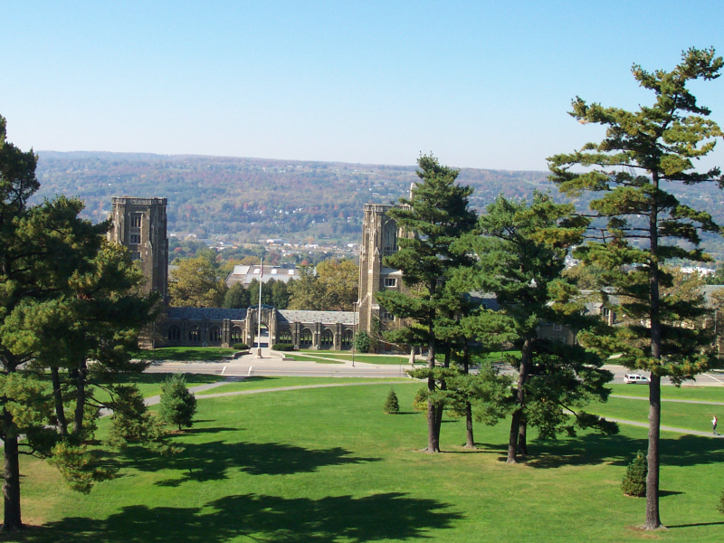

Second Image :  
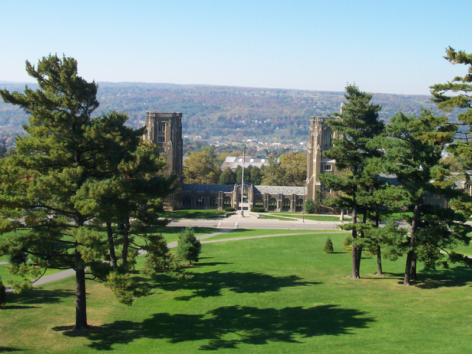

Stitched image from inputs  

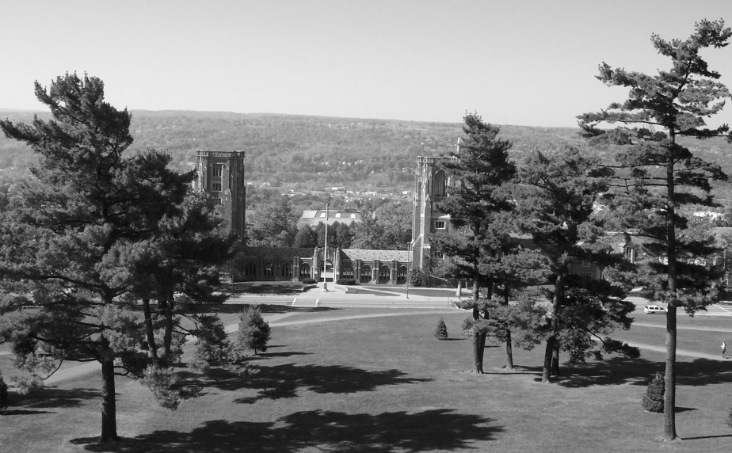

First Image :  
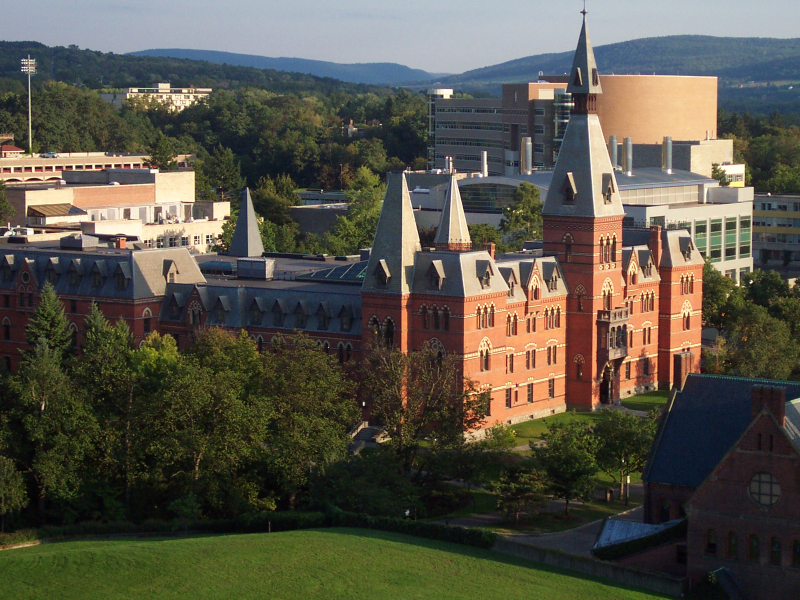

Second Image :  

Stitched image from inputs  

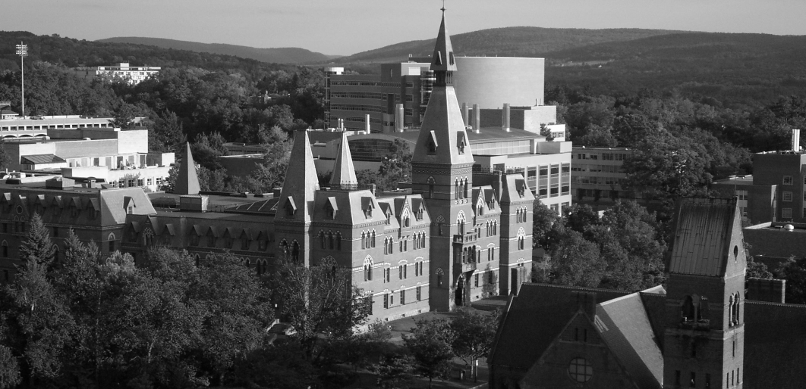

<b>
In addition to Harris, we implemented Tomasi corner detector too.
</b>

<b>Tomasi Corner Detector</b> - Tomasi Corner detector is the advanced version of Harris corner detector difference between two is that
for the R value thus given by
 
R=det(M)-k*trace(M)^2

Where
  
det(M)=lambda1*lambda2  
Trace(M) = lambda1+lambda2
  
However in Tomasi corner detector, it is calculated as
Min(lambda1,lambda2)

Consequentially, Tomasi performs better than the Harris corner detector, even though it is just minor
Modification of Harris. And here are some of the random image I have created based on my face : 

<b>Original Image : </b>

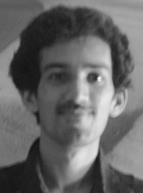

<b>Gaussian Image : </b>

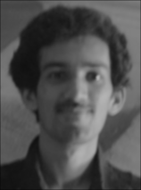

<b> Edge Detection in X Direction : </b>

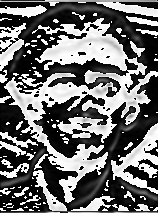

<b>Edge Detection in Y Direction : </b>

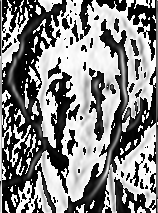

<b> Harris Corner Detection : </b>

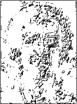

<b> Tomasi Corner Detection : </b>

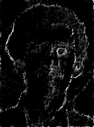

